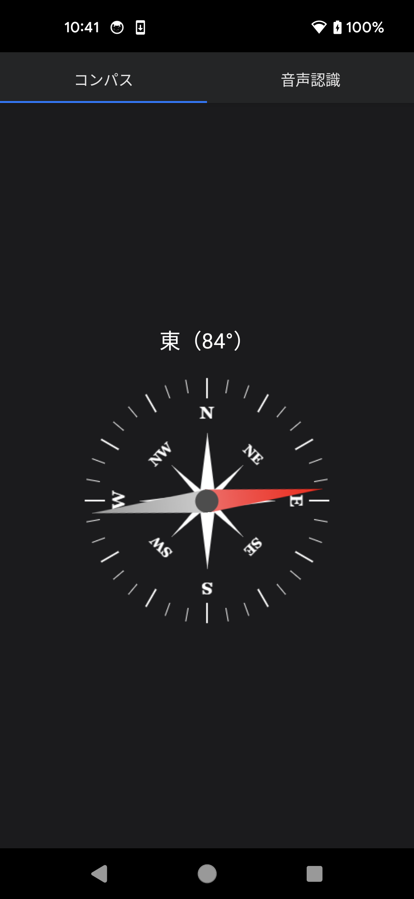
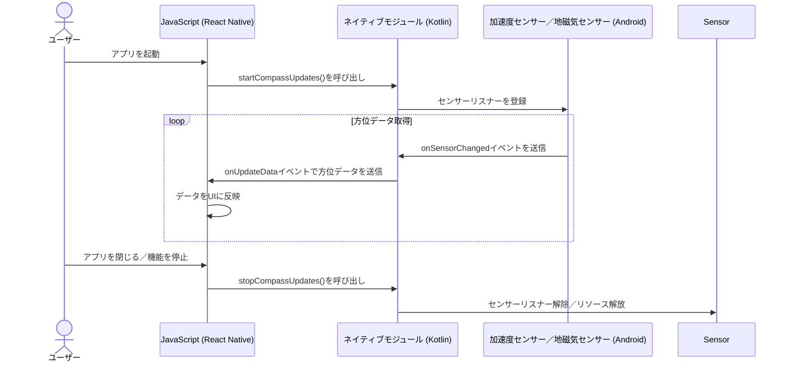
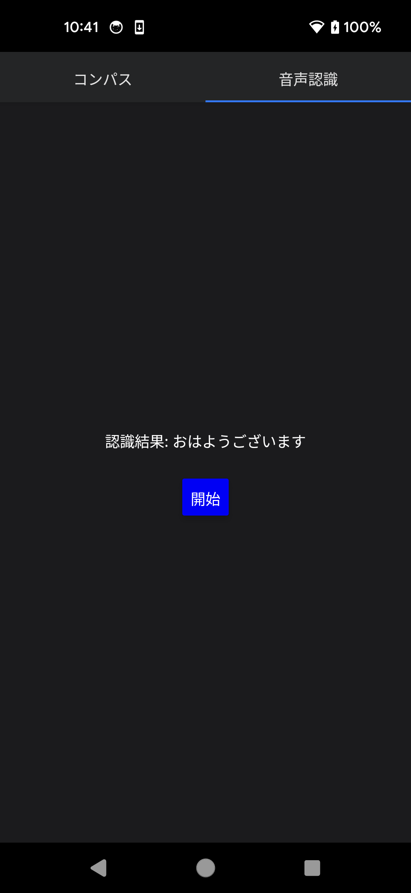
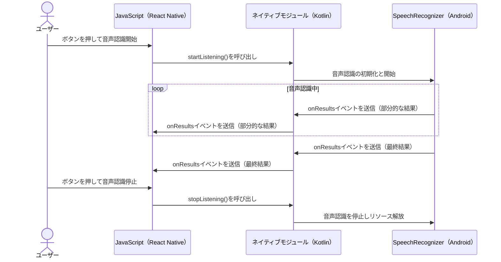

# Native ModuleをKotlinで実装したサンプルアプリ

## 起動

```bash
npm run android
```

## コンパス機能

[android/app/src/main/java/com/samplewithkotlin/compass](./android/app/src/main/java/com/samplewithkotlin/compass)





## 音声認識機能

[android/app/src/main/java/com/samplewithkotlin/speechRecognition](./android/app/src/main/java/com/samplewithkotlin/speechRecognition)




